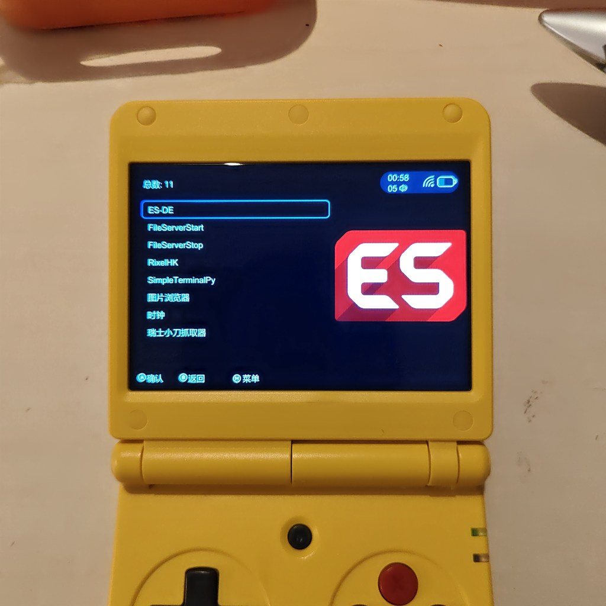
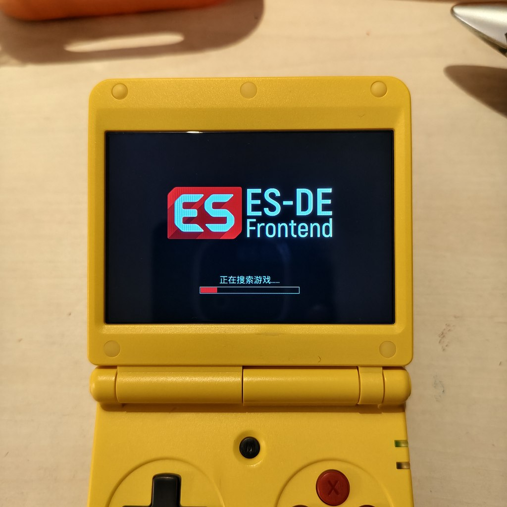
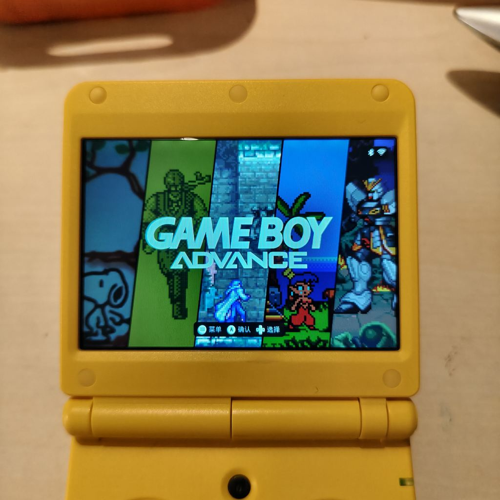

# ES-DE for Anbernic H700(Anbernic 原厂固件)

在 **Anbernic H700 系列掌机**(RG34XXSP / RG35XX Plus / RG35XX H / RG35XX SP / RG35XX 2024 / RG40XX H / RG40XX V / RG28XX / RG CUBEXX / RG34XX)**保留原厂系统**的情况下,以 **dmenu APPS 应用形态**运行 ES-DE 3.4.1(OpenGL ES 渲染,硬件加速)。

不刷机、不换系统、不动启动链 —— 从 dmenu 进入 ES-DE,退出即回原启动器,零风险。

[English version](README.md) | 构建配方:[BUILD_zh.md](BUILD_zh.md)(English: [BUILD.md](BUILD.md))

> **二进制来源**:本仓库的 `es-de` 二进制由官方 **ES-DE v3.4.1** 源码(https://gitlab.com/es-de/emulationstation-de)编译而来,渲染器为针对 H700 的 Mali-G31 GPU 的 OpenGL ES 版(GLES 3.2)。完整构建方法见 [BUILD_zh.md](BUILD_zh.md)。

## 特性

- ES-DE 3.4.1 自编译 **OpenGL ES 版**(Mali-G31 硬件渲染,GLES 3.2,720x480 满帧)
- 游戏启动走**厂商原路**(`RA_launch.sh`):边框、着色器、按机种配置、自动读档/存盘全部与官方启动器一致
- 内置手柄精确映射(A/B/X/Y/L1/L2/R1/R2/方向/SELECT/START;ROM 目录自动扫描 `/mnt/mmc/Roms`)
- **待机(超级待机)**:合盖**或按电源键**整机挂起 —— ES-DE 菜单场景由 standby-daemon 实现,游戏场景走厂商原生通路;电源键唤醒,与原机体验一致
- 主题、刮削、收藏等 ES-DE 完整功能

## 截图

  

## 仓库结构

```
ES-DE-H700/
├── README.md / README_zh.md        ← 本说明(英文 / 中文)
├── BUILD.md / BUILD_zh.md          ← es-de 二进制的构建方法(英文 / 中文)
├── LICENSE                         ← ES-DE 许可证(MIT)
├── install.sh                      ← 一键安装脚本(依赖检查 → 软链 → 部署)
├── uninstall.sh                    ← 卸载脚本(--purge 连用户数据一起删)
├── install.conf                    ← 可选路径配置(APPS/ROM/DATA 目录)
├── esde/
│   ├── es-de                       ← ES-DE 3.4.1 二进制(OpenGL ES 构建,Mali-G31)
│   └── resources/                  ← 运行时数据:系统定义(es_systems.xml /
│   │                                 es_find_rules.xml)、MAME 数据、字体、多语言、
│   │                                 着色器、音效、图形
├── ES-DE.sh                        ← 启动脚本(环境变量 + fontconfig 修复 + --home
│                                     + lid 守护启停)
├── standby-daemon.py               ← 待机守护:合盖或电源键 → 挂起(echo mem),
│                                     电源键唤醒;安装到 /mnt/data/
├── home-template/ES-DE/            ← 用户数据模板,安装时拷到 /mnt/data/es-de-home/ES-DE/
│   ├── settings/es_settings.xml    ← 主设置(预置 ROMDirectory=/mnt/mmc/Roms/ +
│   │                                 CustomEventScripts)
│   ├── settings/es_input.xml       ← 键位映射:SDL 标准按钮 → ES-DE 动作
│   ├── controllers/es_controller_mappings.cfg
│   │                               ← SDL 手柄映射修正(SDL 内置 db 对
│   │                                 ANBERNIC-keys 的条目是错的)
│   └── scripts/game-start|game-end/game-flag.sh
│                                   ← ES-DE 事件脚本:维护"游戏运行中"标志,
│                                     lid 守护据此把游戏场景让位给厂商原生待机
└── retroarch-wrapper.sh            ← 游戏启动委托:把 ES-DE 的 "-L <core> <rom>"
                                      翻译为厂商的 RA_launch.sh <core> <rom>,
                                      并重建 32 位库环境
```

## 安装

把本仓库拷贝到掌机任意目录(建议 `/mnt/mmc/` 下),SSH 进去:

```bash
cd ES-DE-H700
sh install.sh            # 全新安装
sh install.sh upgrade    # 升级:同步程序/资源/脚本 + 模板配置更新(原配置先备份为 .bak)
```

安装完成后,dmenu 的 **APPS** 分类里出现「ES-DE」,直接启动。

### 自定义安装路径

如果你的目录布局与标准 Anbernic 布局不同,安装前编辑 `install.conf`:

```bash
APPS_DIR="/mnt/mmc/Roms/APPS"   # dmenu 应用目录
ROM_DIR="/mnt/mmc/Roms"         # ROM 根目录(写入 ES-DE 的 ROMDirectory)
DATA_DIR="/mnt/data"            # 用户数据/运行库目录
```

安装器会自动读取该文件(不存在则用默认值),并按配置修正部署的 `ES-DE.sh`、`es_settings.xml` 和 `es_find_rules.xml`。之后修改配置需重新运行 `sh install.sh upgrade` 生效。

### 卸载

```bash
sh uninstall.sh            # 移除程序文件,保留用户数据(主题/设置/刮削媒体;
                           # 游戏存档在 RetroArch 自己的配置目录,不受卸载影响)
sh uninstall.sh --purge    # 连同用户数据目录(es-de-home)一起删除
```

## 使用提示

| 事项 | 说明 |
|---|---|
| 键位 | START 打开菜单;**MENU 键无动作**(ES-DE 无 guide 动作,属设计如此) |
| ROM | 标准布局 `/mnt/mmc/Roms/<机种小写>`(如 gba、sfc、fc),vfat 大小写不敏感,大写目录同样识别 |
| 音量 | 游戏内音量走 RetroArch 原配置(与官方启动器一致) |

## 主题

本机实测推荐 **art-book-next**(作者 Anthony Caccese):https://github.com/anthonycaccese/art-book-next-es-de —— 720x480 低分辨率下显示正常。

安装步骤:
1. 从上面的仓库下载 zip(Code → Download ZIP)
2. 解压出 `art-book-next-es-de-main/` 文件夹
3. 放到 `/mnt/data/es-de-home/ES-DE/themes/`(该目录由 ES-DE 首次启动自动创建)
4. 重启 ES-DE,界面里选择该主题即可

## 已知限制

1. **ES-DE 界面无声音**(`SDL_AUDIODRIVER=dummy`):本机 ALSA 设备独占、音量控制被厂商 asound.conf 的 hooks 锁死,启用音频会导致游戏无声。游戏内声音不受影响。完整调研见 `AUDIO_RESEARCH.md`
2. **四个原机平台不显示**:`HBMAME`(自制 MAME)、`PGM2`、`VARCADE`(竖版街机)、`ONS`(ONScripter 视觉小说)在 ES-DE 中没有对应系统,这些游戏仍可在原机启动器游玩
3. **"正常待机"(只关屏不睡眠)未实现**:合盖一律整机挂起(超级待机),与原机一致;只关屏的轻量模式不支持
4. USB 手柄:标准 SDL 手柄自动支持;内置手柄映射文件针对 `ANBERNIC-keys`(GUID `19002cb4...`),不同固件版本若识别名不同,需重新配置键位

## 进阶:启动加速(可选)

默认情况下 ES-DE 每次启动会扫描全部 ROM 目录(大合集约 25-30 秒),好处是新拷入的 ROM 自动出现。如果你更在意启动速度、且能接受一个手动步骤,仓库提供了可选工具:

```bash
python3 generate-gamelists.py      # 批量预生成全部 gamelist(合并模式,可安全重复跑)
# 然后在 ES-DE 里开启「仅解析 gamelist.xml」:主菜单 → 设置 → 其他设置
# 之后启动降到约 10 秒;新增 ROM 需要重跑上面的脚本
```

## 故障排查

| 现象 | 原因与处理 |
|---|---|
| ES-DE 秒退,log 报 `FcWeightFromOpenTypeDouble` | fontconfig 被厂商游戏启动脚本翻到 1.10.1;用 ES-DE.sh 启动会自动翻回 1.12.0(重启 ES-DE 即可) |
| 启动游戏闪退,RA_launch.log 报 `wrong ELF class` | wrapper 环境缺失;确认 `/mnt/data/retroarch-wrapper.sh` 存在且含 32 位库路径 |
| 找不到游戏 | 确认 ROM 在 `/mnt/mmc/Roms/<机种>/`;或改 `es_settings.xml` 的 `ROMDirectory` |
| 键位不对 | 重新校准:删除 `/mnt/data/es-de-home/ES-DE/settings/es_input.xml` 后进 ES-DE 重配 |

日志位置:ES-DE 内部 `/mnt/data/es-de-home/ES-DE/logs/es_log.txt`;启动脚本 stdout `/mnt/mmc/Roms/APPS/esde/log.txt`;游戏启动 trace `/mnt/mod/ctrl/configs/RA_launch.log`。

## 构建

本项目是 ES-DE 3.4.1 在 H700/原厂固件 上的移植发行版,构建配方见 [BUILD_zh.md](BUILD_zh.md)。ES-DE 本体为 MIT 许可(见 LICENSE),上游源码:https://gitlab.com/es-de/emulationstation-de

## 致谢

ES-DE 作者 Leon Styhre / Northwestern Software AB;Anbernic H700 社区。
